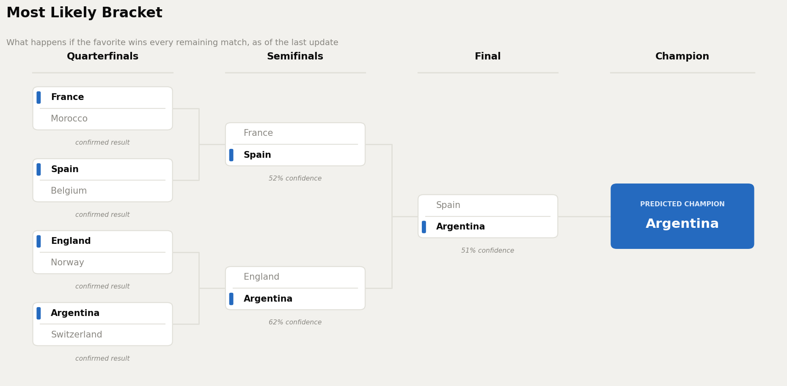
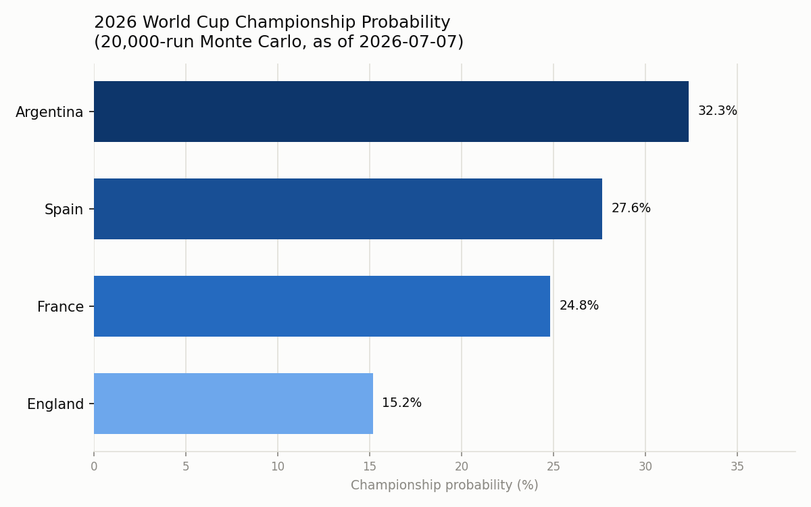

# 2026 World Cup Predictor

I built a model that predicts the rest of the 2026 World Cup while the
tournament is still happening, on purpose, so there's nowhere to hide if it's
wrong. It uses 154 years of international football results to rate every
national team, then simulates the remaining bracket thousands of times to get
a championship probability for each team still alive.

First run: July 7, 2026. The final is July 19. This README gets updated as
real results come in, so you can watch the model get graded live instead of
taking my word for it. No quietly editing the predictions after the fact —
whatever it said before kickoff is what's on the record.

## Where things stand right now (last updated July 13, 2026)

The Round of 16 is done. All 16 matches played, including two nail-biters:
Argentina came back from 2-0 down to beat Egypt 3-2, and Switzerland needed
penalties to get past Colombia after 120 scoreless minutes.

All four quarterfinals are done, and the semifinals are set. **France beat
Morocco 2-0** in Boston, Mbappé and Dembélé with the goals. **Spain beat
Belgium 2-1** in Los Angeles, Mikel Merino settling it with an 88th-minute
rebound. **England beat Norway 2-1 after extra time** in Miami on a
Bellingham brace, the winner arriving in the third minute of extra time.
Then **Argentina beat Switzerland 3-1**, also after extra time: Mac Allister
headed Argentina in front early, Ndoye equalized for ten-man Switzerland
(Breel Embolo saw red on the hour), and Julian Álvarez and Lautaro Martínez
put it away in extra time.

The model called all four before kickoff: France 63.6%, Spain 64.4%, England
61.4%, Argentina 72.8%. Four for four, no shocks yet — the underdogs kept it
close, but chalk held every single time.

The semifinal lineup, July 14-15:

- **France vs Spain**, Dallas, July 14
- **England vs Argentina**, Atlanta, July 15

Everything below reflects that state. A scheduled job re-runs this whole
project once the semifinals wrap up, and once more after the July 19 final,
so the numbers keep catching up to reality without me manually babysitting
it.

## Most likely bracket

If the favorite wins every single remaining match, here's how the rest of
the tournament plays out:



This is a different question than "which team has the best championship
odds overall" (that's further down). This one just walks the bracket picking
the favorite at each stage and follows it all the way to the final — no
hedging, no maybes, just "if chalk holds, here's your winner." See the
championship probability section below for why the two questions can point
at different teams. Right now they happen to agree, on Argentina.

## The boring stuff (How it works):

**1. The data.** [This Kaggle dataset](https://www.kaggle.com/datasets/martj42/international-football-results-from-1872-to-2017)
has about 49,500 international football results going back to 1872. It
updates automatically, though it tends to lag real games by a day or two, so
I patch in confirmed scores from actual news coverage when the dataset
hasn't caught up yet. Every patched score is sourced and cross-checked
against at least two outlets, listed at the bottom of this file.

**2. Elo ratings.** Team strength isn't something you can just look up in a
spreadsheet, so I built it: replay every match in the dataset in order,
updating each team's rating after each result the same way chess Elo works,
adjusted for goal difference and how much the competition matters (a World
Cup match moves the needle a lot more than a friendly). A match from 1990
still technically contributes to a team's rating today, but only in the way
a whisper from three rooms away "contributes" to a conversation — by the
time you get to 2026, thousands of more recent results have overwritten it.
This is really the whole project. Everything downstream just uses these
numbers.

**3. Features.** For each match: both teams' Elo rating going in, the gap
between them, whether the game is at a neutral venue, how important the
competition is, and each team's recent form (goal difference over their last
10 games).

**4. The model.** A logistic regression baseline and an XGBoost classifier,
both predicting win, draw, or loss. Trained on everything before January
2024, tested on games from January 2024 up to the day before this World Cup
started. No shuffling. Sports results happen in order, and testing on the
past using knowledge of the future is how you fool yourself into thinking a
model works.

**5. The backtest.** This is the part I actually care about, and the part
most sports-model writeups conveniently skip. Instead of just trusting the
generic validation numbers, I ran the trained model against every 2026 World
Cup match played so far and checked how it actually did. No cherry-picking,
every match counts, wins and misses both included, misses printed right
alongside the wins.

**6. The simulation.** Using the confirmed bracket and the model's win
probabilities, I simulate the rest of the tournament 20,000 times. Draws in
a knockout match get split 50/50, standing in for the penalty shootout coin
flip. Add up how often each team wins it all across those 20,000 runs and
you get a championship probability table.

## Results so far

Scoreboard, no spin.

### Generic validation (games from 2024 to just before this World Cup)

| Model | Accuracy | Log-loss |
|---|---|---|
| Logistic regression | 59.9% | 0.871 |
| XGBoost | 59.9% | 0.869 |

For context, always guessing "home team wins" gets you about 49% on this
dataset, and guessing randomly among the three outcomes gets you 33.3%. So
the model is doing real work, just don't expect it to be right every time.
Football is famously hard to predict, which is most of why it's fun to watch.

### This exact World Cup, 100 matches played (group stage through all four quarterfinals)

| Model | Accuracy | Log-loss |
|---|---|---|
| Logistic regression | 65.0% | 0.844 |
| XGBoost | **66.0%** | **0.838** |

Slightly better than the generic numbers, which is a good sign, not a red
flag. It means the model isn't just memorizing history, it's picking up on
something real about team strength that's holding up in the actual
tournament. Full match-by-match predictions are in
[`results/wc2026_backtest_detail.csv`](results/wc2026_backtest_detail.csv) if
you want to see every call, right and wrong.

A couple of calls worth flagging honestly: the model correctly picked
Argentina to beat Egypt, but leaned slightly toward Colombia in a match that
ended level and went to penalties. Every quarterfinal went the model's way —
France over Morocco, Spain over Belgium, England over Norway, Argentina over
Switzerland. Draws are still the hardest outcome to predict in this sport,
and this model is no exception.

### Quarterfinal win probabilities

| Match | Result |
|---|---|
| France vs Morocco | **France won 2-0.** Model had France 63.6% before kickoff. Correct. |
| Spain vs Belgium | **Spain won 2-1.** Model had Spain 64.4% before kickoff. Correct. |
| England vs Norway | **England won 2-1 (aet).** Model had England 61.4% before kickoff. Correct. |
| Argentina vs Switzerland | **Argentina won 3-1 (aet).** Model had Argentina 72.8% before kickoff. Correct. |

### Semifinal win probabilities

| Match | Model says |
|---|---|
| France vs Spain | Spain 52.0%, France 48.0% |
| England vs Argentina | Argentina 62.0%, England 38.0% |

France vs Spain is close to a coin flip, England vs Argentina is not. Both
kick off July 14-15, so these are still predictions, not results.

### Championship probability (20,000 simulated tournaments)



| Team | Reaches semis | Reaches final | Wins it all |
|---|---|---|---|
| Argentina | 100% | 62.3% | **32.3%** |
| Spain | 100% | 52.2% | 27.6% |
| France | 100% | 47.8% | 24.8% |
| England | 100% | 37.7% | 15.2% |

Full numbers in [`results/championship_probabilities.csv`](results/championship_probabilities.csv).
With all four quarterfinals confirmed, this table is now just two coin flips
deep: win your semifinal, then win the final. Argentina jumped to the top
mainly on the strength of a 62% edge over England in the semifinal — the
biggest single-match mismatch left in the bracket. Switzerland's whole 2.9%
share is gone the moment the final whistle blew in Kansas City.

The most-likely-bracket diagram up top agrees with the championship table
again: both point to **Argentina**. Both are answering the same question
right now purely because there's less room left for them to disagree — with
just four matches standing between here and the trophy, "most total paths"
and "favorite wins every time" have far fewer ways to diverge than they did
back when half the bracket was still uncertain. Full data in
[`results/most_likely_bracket.json`](results/most_likely_bracket.json).

## The bracket

```
QF1 Boston, Jul 9:     France 2-0 Morocco (FINAL)  -+
QF2 LA, Jul 10:        Spain 2-1 Belgium (FINAL)   -+- SF1, Dallas, Jul 14 -+
QF3 Miami, Jul 11:     England 2-1 Norway aet (FINAL) -+                    |
QF4 KC, Jul 11:        Argentina 3-1 Switzerland aet (FINAL) -+- SF2, Atlanta, Jul 15 -+- Final, Jul 19, East Rutherford
```

This gets re-run after the quarterfinals wrap up, again after the
semifinals, and a final time after the July 19 final, when we find out how
right or wrong all of this actually was — in public, with a paper trail.

## Sources for patched match results

- Brazil 1-2 Norway, July 5: [Al Jazeera](https://www.aljazeera.com/sports/liveblog/2026/7/5/brazil-vs-norway-live-fifa-world-cup-2026-last-16), [FIFA.com](https://www.fifa.com/en/match-centre/match/17/285023/289288/400021532)
- Mexico 2-3 England, July 5: [ESPN](https://www.espn.com/soccer/match/_/gameId/760505/england-mexico)
- Portugal 0-1 Spain, July 6: [ESPN](https://www.espn.com/soccer/match/_/gameId/760506/spain-portugal), [CBS Sports](https://www.cbssports.com/soccer/news/portugal-spain-live-updates-world-cup-2026-score-result/live/)
- United States 1-4 Belgium, July 6: [ESPN](https://www.espn.com/soccer/match/_/gameId/760507/belgium-united-states), [NPR](https://www.npr.org/2026/07/06/nx-s1-5883842/2026-world-cup-fifa-usmnt-belgium-round-of-16)
- Argentina 3-2 Egypt, July 7: [ESPN](https://www.espn.com/soccer/story/_/id/49262413), [NBC News](https://www.nbcnews.com/sports/soccer/live-blog/fifa-world-cup-games-2026-july-7-live-updates-rcna353305)
- Switzerland 0-0 Colombia (Switzerland won 4-3 on penalties), July 7: [CNN](https://www.cnn.com/2026/07/07/sport/argentina-egypt-colombia-switzerland-world-cup-round-of-16), [Al Jazeera](https://www.aljazeera.com/sports/liveblog/2026/7/7/live-switzerland-vs-colombia-fifa-world-cup-2026)
- France 2-0 Morocco, July 9: [FIFA.com](https://www.fifa.com/en/match-centre/match/17/285023/289289/400021536), [ESPN](https://www.espn.com/soccer/match/_/gameId/760510/morocco-france), [CNN](https://www.cnn.com/2026/07/09/sport/live-news/france-morocco-world-cup-score)
- Spain 2-1 Belgium, July 10: [ESPN](https://www.espn.com/soccer/match/_/gameId/760511/belgium-spain), [CNN](https://www.cnn.com/2026/07/10/sport/live-news/spain-belgium-world-cup-score), [Al Jazeera](https://www.aljazeera.com/sports/liveblog/2026/7/10/spain-vs-belgium-live-fifa-world-cup-2026-quarterfinal), [Fox Sports](https://www.foxsports.com/soccer/fifa-world-cup-men-spain-vs-belgium-jul-10-2026-game-boxscore-607928)
- England 2-1 Norway (aet), July 11: [ESPN](https://www.espn.com/soccer/match/_/gameId/760512/england-norway), [FIFA.com](https://www.fifa.com/en/match-centre/match/17/285023/289289/400021539), [Al Jazeera](https://www.aljazeera.com/sports/liveblog/2026/7/11/england-vs-norway-live-fifa-world-cup-2026-quarterfinal), [NPR](https://www.npr.org/2026/07/11/nx-s1-5890169/2026-world-cup-fifa-england-norway-quarterfinal)
- Argentina 3-1 Switzerland (aet), July 11: [ESPN](https://www.espn.com/soccer/match/_/gameId/760513/switzerland-argentina), [FIFA.com](https://www.fifa.com/en/tournaments/mens/worldcup/canadamexicousa2026/articles/argentina-switzerland-match-report-highlights), [Al Jazeera](https://www.aljazeera.com/sports/2026/7/12/argentina-defeat-switzerland-to-set-up-england-semifinal-at-world-cup-2026), [Yahoo Sports](https://sports.yahoo.com/articles/argentina-vs-switzerland-live-score-200002967.html)
- Quarterfinal bracket: [Olympics.com](https://www.olympics.com/en/news/fifa-world-cup-2026-bracket-quarter-finals-full-schedule-live-updates), [Fox Sports](https://www.foxsports.com/stories/soccer/world-cup-bracket-live-quarterfinals-update-standings)

## Running it yourself

```
pip install -r requirements.txt
python3 src/model.py       # trains both models, saves them plus metrics
python3 src/backtest.py    # scores the model against this World Cup so far
python3 src/simulate.py    # simulates the rest of the bracket 20,000 times
python3 src/chart.py       # draws the championship probability chart
python3 src/bracket_chart.py  # draws the most-likely-bracket diagram
```

## What's in this repo

```
data/           raw match history from Kaggle
src/
  load_data.py  loads the data, patches in results the dataset hasn't caught up on yet
  elo.py        the Elo rating engine, the heart of the project
  features.py   turns Elo ratings into model-ready features
  model.py      trains the logistic regression and XGBoost models
  backtest.py   grades the model against this exact World Cup
  simulate.py   Monte Carlo simulation of the remaining bracket, plus the most-likely-bracket walk
  chart.py      the championship probability chart
  bracket_chart.py  the most-likely-bracket diagram
results/        trained models, metrics, backtest detail, probability tables and charts
```
